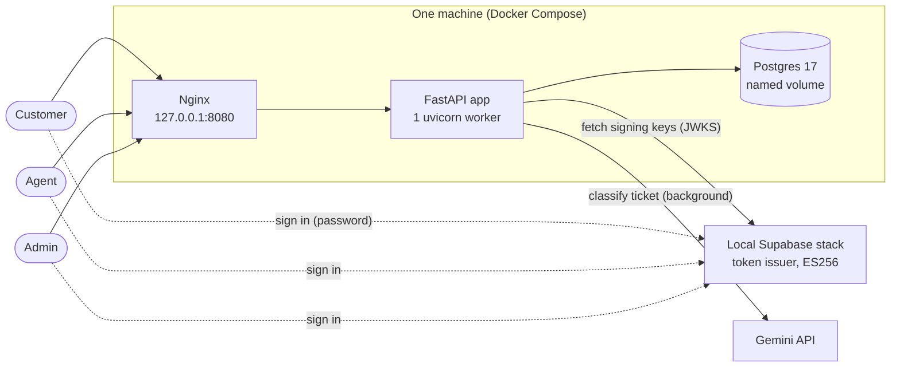
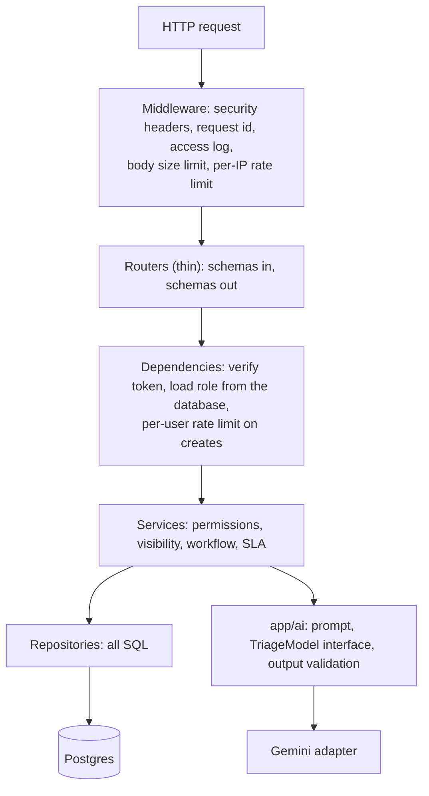
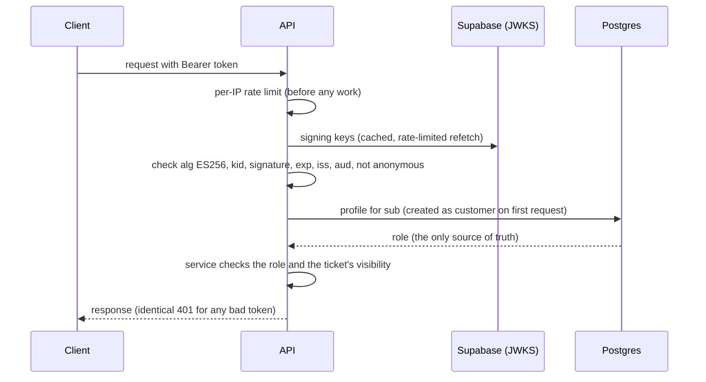
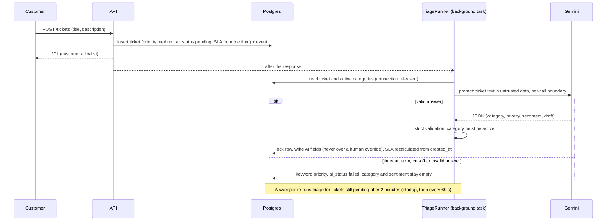
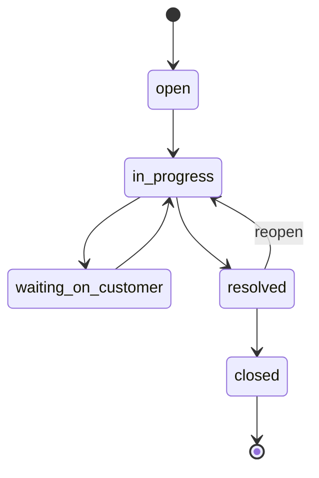
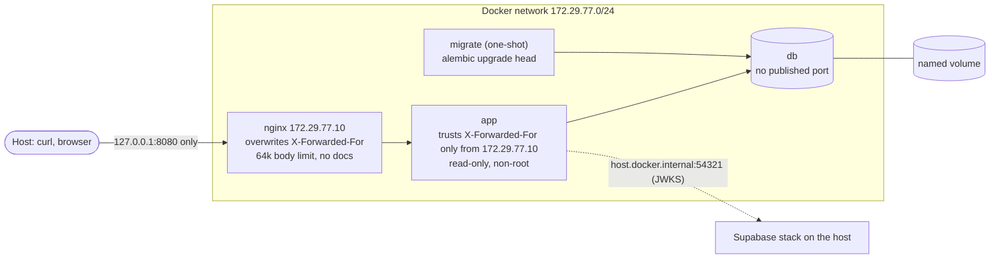

# Architecture

TriageDesk API is a single FastAPI service. This page shows how the pieces fit; the decisions behind them are in `docs/adr/`,
the data model (with its ER diagram) in `docs/data-model.md`, and the endpoints in `docs/api-contract.md`.

## 1. Context

Supabase only issues tokens. The API verifies them and keeps roles in its own database; it never trusts a role claim.

## 2. Inside the app

Rules that hold everywhere: routers never touch the ORM; permissions live in the service layer (not in Postgres policies);
a ticket you may not see is a 404; customers get separate allowlist response schemas.

## 3. Authentication and role lookup

## 4. Ticket creation and AI triage

## 5. Status workflow

Only the assignee agent or an admin changes status; customers never do. Every other transition is a 409 `invalid_transition`.
`closed` is final and takes no comments. Every change writes a `ticket_events` row in the same transaction.

## 6. Deployment (local production)

See `docs/runbook.md` for start, stop, backup and restore.
