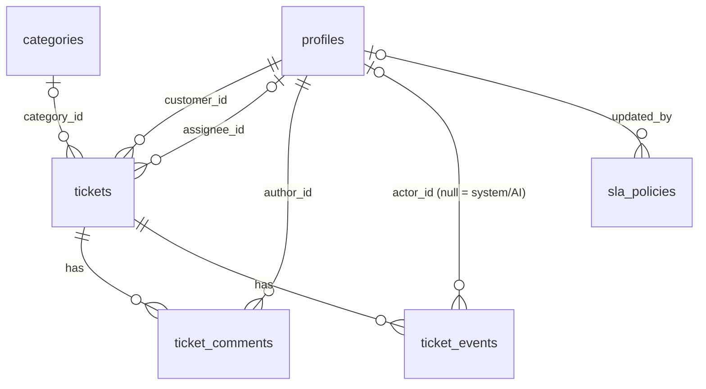

# Data model and first migration: PROPOSAL (awaiting owner approval)

No model or migration code exists yet. Everything here follows `docs/PRD.md`.

## Conventions

- Timestamps are `timestamptz`, set in UTC. `created_at` defaults to `now()`; `updated_at` is set by the app on update.
- Primary keys: UUID (`gen_random_uuid()`, built in since PG 13) for tables whose ids appear in the API (profiles, tickets, comments).
  Small lookup tables use an integer identity key. `ticket_events` uses a bigint identity key (ordered, never exposed).
- Enums are `text` columns with CHECK constraints, not native Postgres enums. Native enums are hard to change under expand/contract.
- All foreign keys are `ON DELETE RESTRICT`. Nothing is ever deleted (tickets are never deleted; categories are soft-deactivated).
- No foreign key to Supabase's `auth.users` (that schema does not exist in the Docker test database). `profiles.id` holds the JWT `sub`.

## ER diagram

## Tables

### profiles
| Column | Type | Notes |
|---|---|---|
| id | uuid PK | the Supabase user id (JWT `sub`); inserted with `ON CONFLICT DO NOTHING` |
| email | text null | copied from the JWT email claim when present, so admins can identify users |
| role | text not null, default `customer` | CHECK in (`customer`, `agent`, `admin`) |
| created_at, updated_at | timestamptz | |

### categories
| Column | Type | Notes |
|---|---|---|
| id | int identity PK | integer ids keep the AI prompt and structured output simple |
| name | text not null | unique on `lower(name)` |
| description | text null | used in the triage prompt |
| is_active | bool not null default true | soft-deactivate only |
| created_at, updated_at | timestamptz | |

### sla_policies
| Column | Type | Notes |
|---|---|---|
| priority | text PK | CHECK in (`low`, `medium`, `high`, `urgent`); exactly one row per priority |
| response_hours | int not null | CHECK > 0 |
| resolution_hours | int not null | CHECK >= response_hours |
| updated_at | timestamptz | |
| updated_by | uuid null | FK profiles (null for seeded rows) |

### tickets
| Column | Type | Notes |
|---|---|---|
| id | uuid PK | |
| customer_id | uuid not null | FK profiles |
| assignee_id | uuid null | FK profiles; role (agent or admin) checked in the service layer |
| title | varchar(200) not null | |
| description | text not null | CHECK length between 1 and 10000 |
| category_id | int null | FK categories; null until triage or a human sets it |
| category_source | text null | CHECK in (`ai`, `human`) |
| priority | text not null default `medium` | CHECK in the four priorities |
| priority_source | text not null default `default` | CHECK in (`default`, `ai`, `keyword`, `human`) |
| sentiment | text null | CHECK in (`positive`, `neutral`, `negative`) (values are my proposal) |
| status | text not null default `open` | CHECK in the five statuses |
| ai_status | text not null default `pending` | CHECK in (`pending`, `completed`, `failed`) |
| ai_suggested_reply | text null | |
| ai_model | text null | model name for traceability |
| ai_prompt_version | text null | prompt version for traceability |
| first_response_due_at | timestamptz not null | |
| resolution_due_at | timestamptz not null | |
| first_responded_at | timestamptz null | |
| resolved_at | timestamptz null | cleared on reopen |
| search_vector | tsvector, generated stored | `to_tsvector('english', title || ' ' || description)` |
| created_at, updated_at | timestamptz | |

Invariants enforced in the database (CHECK):
- `(status IN ('resolved','closed')) = (resolved_at IS NOT NULL)`. Reopen clears `resolved_at`, so this holds on every transition.
- Triage never overwrites a human override: this is a service rule (`WHERE category_source IS DISTINCT FROM 'human'` in the update), tested in Phase 5.

Breach (not stored): `(first_responded_at IS NULL AND now() > first_response_due_at) OR (resolved_at IS NULL AND now() > resolution_due_at)`,
implemented as a SQL expression plus a Python property in Phase 6.

### ticket_comments
| Column | Type | Notes |
|---|---|---|
| id | uuid PK | |
| ticket_id | uuid not null | FK tickets |
| author_id | uuid not null | FK profiles |
| author_role | text not null | role at write time; gives the customer-facing `author_type` (customer, or support for agent and admin) without exposing the author |
| body | text not null | CHECK length between 1 and 10000 |
| is_internal | bool not null default false | CHECK `NOT (is_internal AND author_role = 'customer')` |
| created_at | timestamptz | |

### ticket_events (audit log)
| Column | Type | Notes |
|---|---|---|
| id | bigint identity PK | |
| ticket_id | uuid not null | FK tickets |
| actor_id | uuid null | FK profiles; null means system or AI |
| event_type | text not null | e.g. `ticket_created`, `status_changed`, `assigned`, `released`, `category_changed`, `priority_changed`, `triage_completed`, `triage_failed`, `resolved_at_cleared` |
| from_value | text null | |
| to_value | text null | the cleared `resolved_at` is stored as an ISO timestamp in `from_value` of `resolved_at_cleared` |
| created_at | timestamptz | |

## Indexes

| Index | Why |
|---|---|
| tickets(status) | status filter |
| tickets(assignee_id) | agent queue |
| tickets(created_at) | default sort and pagination |
| tickets(customer_id, created_at) | customers see only their own tickets (not in your list, but needed by the role rule) |
| tickets(first_response_due_at) WHERE first_responded_at IS NULL | breach query (partial) |
| tickets(resolution_due_at) WHERE resolved_at IS NULL | breach query (partial) |
| GIN on tickets(search_vector) | full-text search |
| ticket_comments(ticket_id, created_at) | comment list |
| ticket_events(ticket_id, created_at) | audit history |

## Migration plan

One revision `0001_initial` creates the tables, constraints and indexes above, with a `downgrade()` that drops them in reverse order.
Tests: `upgrade head`, `downgrade base`, `upgrade head` on a fresh Postgres 17; autogenerate shows no diff against the models.
CI runs `alembic upgrade head` on a fresh Postgres.

## Seed (idempotent)

- Categories (proposal): Billing, Technical Issue, Account Access, Feature Request, General Inquiry. Inserted by name with `ON CONFLICT DO NOTHING`, so admin edits are never overwritten.
- SLA policies (response / resolution hours, proposal): urgent 1 / 4, high 4 / 24, medium 8 / 72, low 24 / 168. Same `DO NOTHING` rule.
- Bootstrap admin: env var `BOOTSTRAP_ADMIN_SUB` (the Supabase user id). The seed upserts that profile with `role=admin`. Safe to re-run.

## Decisions I need from you

1. Sentiment values: `positive`, `neutral`, `negative`. OK?
2. `ai_status` values: `pending`, `completed`, `failed` (the fallback path is `failed` with keyword priority, as in the PRD). OK?
3. Partial indexes for the two SLA due columns (smaller and exactly what the breach query reads) instead of plain indexes. OK?
4. `customer_id` composite index: added because of the customer role rule. OK?
5. `profiles.email` (nullable) so admins can tell users apart. No `is_active` / deactivation, because you did not ask for it. OK?
6. Role changes are not audited (only ticket history is, as specified). OK?
7. Full-text search uses the `english` configuration. OK, or another language?
8. Seed categories and SLA numbers above: OK or change?

## What could break (doubt pass)

- The `resolved_at` CHECK makes a buggy transition fail loudly instead of corrupting SLA data; the service must set `resolved_at` and `status` in one UPDATE.
- `search_vector` as a generated column rewrites the table on later changes to its expression; fine now (empty table), noted for expand/contract.
- No FK to `auth.users` means a profile could exist for a deleted Supabase user; harmless because tokens would no longer verify.
- Text + CHECK enums need a migration to add a value; accepted trade-off against native enums.
